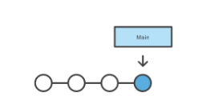
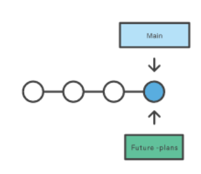
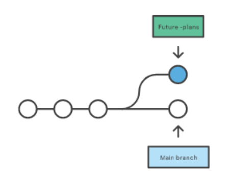
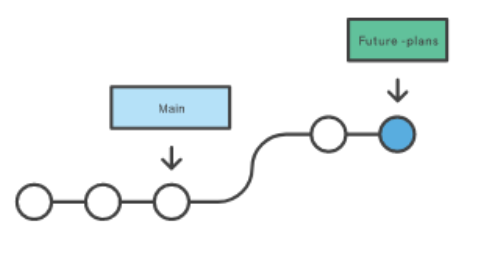
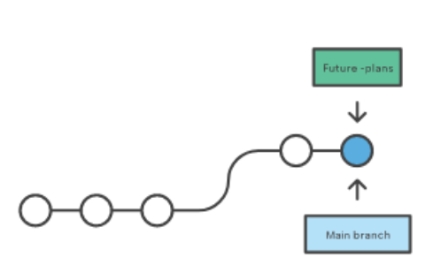
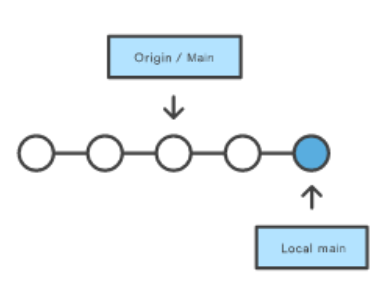

# Branques

## Git main branch 

La branca main és la branca principal de tot projecte de git, és la que tindrem tot el codi principal i (a poder ser) amb la seguretat de que el codi que tenim allà està lliure d’errors. I per tant que les funcionalitats que té implementades ja estan funcionant. 



## Git branch

Normalment, no desenvolupem a la branca main, ja que com s’ha indicat abans, aquesta s’ha de mantenir funcional. És per això que cada vegada que volem afegir una nova funcionalitat (feature) creem una nova branca partint de main que ja sabem que “funciona”. 

Per tal de crear una branca nova desde main, ens hem d’assegurar que estem a main. Això ara no sembla important i sembla obvi, però en un projecte on tens múltiples branques, pot complicar la cosa. 
```sh
git status

git branch future-plans
```



Aquí, de moment, internament només s’ha creat un apuntador a la nova barnca, per a fer efectiu el canvi hem de fer un checkout 
```sh
git checkout future-plans 
```



Ara aquí sí que hem fet el canvi, per tant estem treballant a la branca future-plans

Podem afegir nous fitxers o modificar els fitxer que ja tenim creats. Anem a veure pas per pas que passa.. 

Creem fitxer nou i fem un commit:
```sh
echo "new" > new.txt

git commit -m "adding new file"
```

Una vegada fet el commit ens trobem en aqueta situació: 



Per entendre que està passant anem a fer una prova: 
```sh
ls 

git checkout main

ls 

git checkout future-plans
```

Algú sabria dir que ha passat?

Anem a fer el mateix ara modificant un fitxer que ja teniem a main: 
```sh
echo "canvi" > hola.txt

git add hola.txt

git commit -m "afegint canvi a hola.txt"
```

Per entendre que està passant anem a fer una prova: 
```sh
ls 

git checkout main

ls 

git checkout future-plans
```

Algú sabria dir que ha passat?

## Merging branches

La següent pregunta seria, molt bé, però.. i ara com reuneixo els canvis que he fet amb el que tenia anteriorment a main?

Doncs bens senzill, per això utilitzem la comanda merge, ara bé hem d’anar en compte! Quan fem merge ho fem desde una branca A i decidim fer merg de la branca B, per tant el que estem fent és portar-nos el codi de la branca B a la A. 

Ara bé si jo vull afegir els canvis que he fet a la branca future-plans  a la branca main, el que hauré de fer és primer de tot situar-me a la branca main. 
```sh
git checkout main 

git merge future-plans
```

Ara ens torbem en aquesta situació 




És una bona pràctica, que al finalitzar el proposit pel qual la branca va ser creada, aquesta sigui destruïda per sempre més. Si no pot esdevenir un veritable mal de cap. 
```sh
git branch -d future-plans 
```

I ara ens trobem en aquesta situació. Això el git ho fa per a poder distingir quin és el punt on es troba el nostre repositori remot i en quin pun es troba en local. 



Si volem que els dos es trobin al mateix punt, el que haurem de fer és un git push
```sh
git push origin main
```
