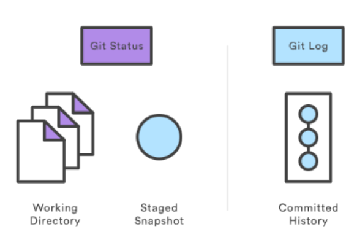

## Git log
La comanda git log mostra l’historial dels commits fets. Permet llistar l'historial del projecte, filtrar-lo i cercar canvis específics. Mentre que git status  permet inspeccionar el directori de treball i d’taging.


```sh
git log
git log -n <limit>
git log --oneline
```


## Git diff

A vegades ens pot interessar veure quines son les diferencies que hi ha entre diversos estats de git, això és útil per saber quins canvis hem fet, o es van fer en passat. Per ex: què és el que es va afegir per tal de que ara ens dongui aquest bug si abans no hi era?

Llavors podem distingir difrents tipus de diff. El primer seria sense tenir res modificat al HEAD comparar dos commits diferents. 

Això ho podem fer de la següent manera: 
```sh
git diff 1234abc..6789def # old new
```

- vol dir que s’ha eliminat la linia i + que s’ha afegit, si hi hi ha - i un + seguits ens indica que s’ha substituit una linia per l’altre

Una altre opció que tenim és veure els canvis que dels fitxers que hem modificat, preparats per afegir, pero que encara no hem fet el git add

Si modifiquem un fitxer i fem un 
```sh
git diff
```

En canvi si fem el git add i fem el git diff no veurem les diferencies, per poder-ho veure haurem de fer: 
```sh
git diff --staged
```

També podem mirar diferències entre dos fitxers del mateix lloc de treball: 
```sh
git diff -- file1.txt file2.txt
```

podem fer git diff entre branques: 
```sh
git diff original new # equivalent to original..new
```

igual ens interessa més veure quines diferencias hi ha hagut sobre un fitxer

```sh
git diff main feature-branch file.txt
```

o potser ens convé fer-ho per dates 
```sh
git log --before="2023-01-01" --after="2022-01-01" --follow -- file.txt
```

A vegades només veient les linies que han canviat no acabem d’entendre el canvi i volem afegir-hi context, això ens afegeix lines anteriors i posteriors al canvi
```sh
git diff --unified=5 <commit1>..<commit2>
```

I si volem anar a un nivell més granular, podem veure diferències a nivell de paraula. 
```sh
git diff --word-diff <commit1>..<commit2>
```

