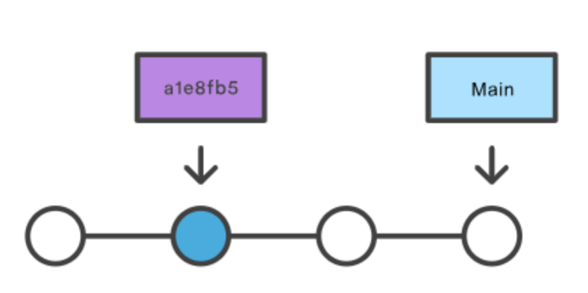
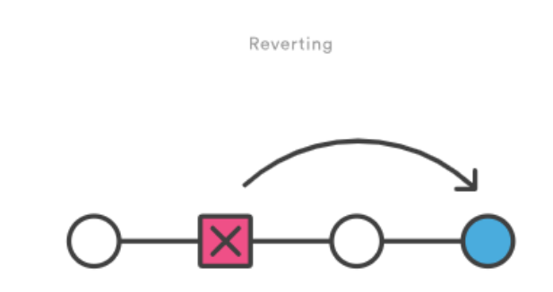
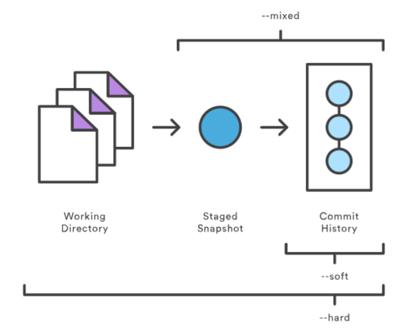
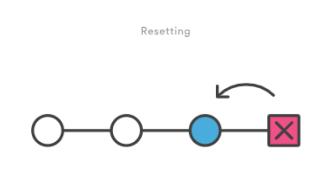

# Com desfer les coses a git

Evidentment si hi ha alguna cosa que no ha anat com espervaem i volem desfer o tornar a un estat anterior, hem de poder-ho fer.

Per tant git ens proporciona unes quantes eines per a fer-ho. 

## Checkout a un commit anterior

Si fem un checkout a un commit anterior, veurem que anem a un estat amb el codi com el teniem prèviament a la fase de desenvolupament on ens trobem. Allà podrem executar, correr tests, i fer comprovacions si cal. Ara bé, ens trobarem en un estat de detached HEAD.



## Nova branca desde commit anterior

Aleshores, una possible estratègia seria desde el commit anterior, crear una branca nova. Això ho podem fer amb 
```sh
git checkout -b new-branch-from-commit
```

Ara bé, això pot ser una mala estratègia ja que perdriem tots els commits que haviem fet fins ara . Això pot ser útil si en algun punt se’ns ha complicat la cosa tant que partim d’un commit segur i fem un branca nova que es convertirà en el nostre nou històric de treball, sense el commits “on hi havia errades”. Ara bé aquesta no és una bona estratègia si la branca que es veu afectada es la main. .

## Git revert

Git ens ofereix una forma més segura de desfer canvis i una d’elles és git revert. L’utilitzem per desfer els canvis de l’ultim commit, ara bé els desfà d’una forma peculiar, ens afegeix els canvis desfets com un commit nou. 

Per a comprovar el revert, farem un commit nou aplicat uns canvis. Una vegada haguem fet el commit farem: 
```sh
git revert HEAD
```

Amb això podrem afegir el missatge que volem al nou commit generat i podrem comprovar que efectivament s’ha creat un nou commit amb git log



## Git reset

Ens permet tornar a un estat anterior, i tenim 3 opcions –hard, –mixed i –soft 



En els tres casos ens trobem en aquesta situació: 



## Git Reset Soft
El primer dels tres tres modes es el de –soft. Això el que fa és, apuntar el HEAD a un commit anterior, desfà els canvis que s’han fet en els commits intermitjos, però posant-los en l'índex, per poder-los afegir en un nou commit si fes falta. 

Mirem un exemple. Posem que estem treballant en una branca main on tenim els següents commits o 98cs9, 34ac2, i f30ab, en aquest ordre de més antic a més nou. 

SI el HEAD està apuntant a f30ab a l'inici, i després fem un git reset –soft 98ca9, HEAD es mourà cap aquell commit, també el punter que apunta a main. .  

Tots els canvis que haviem fet a 34ac2 and f30ab es preservaran i es re-afegiran com “staged”.

## Git Reset Mixed

Idem que soft pero sense posar els canvis a “staged”  

## Git reset Hard

Però en concret, el git reset –hard: ens fa un reset cap a un commit anterior esborrant l’històric de commits. El que tinguem en el “staged” i els fitxers que haguem modificat. 

Això pot ser una bona estratègia si només estem treballant en local: ex una branca nova que encara no s’ha fet push. Però si pel que sigui fem un reset i ens carreguem un commit que ja havia estat pujat al repo, quan intentem fer push dels nous canvis ens donarà problemes. 

## Activitat 2

Anem a fer una prova de cada un per entendre que fan

Fer clone de: https://github.com/eblazqu3/dawbim08undoing.git

nano Fer branques noves a través de commits antincs
A1.1 Fer una branca nova per a desenvolupar opció de mostrar dades usuari. 
	A1.2 Fer un primer commit amb la funció
	A1.3 Fer un commit ple de bugs (emulant errades insalvables)
	A1.4 Fer un checkout a commit anterior creant una branca nova

A2- Fer un revert de la branca main
	A2.1 Provocar un error a main
	A2.2 Fer un revert 

A3- Fer resets a la branca main
	A3.1 Crear un parell de commits nous amb modificacions 
	A3.2 Fer un git reset soft 
	A3.3 Tronar a fer un commit 
	A3.4 Fer un reset mixed 
	A3.5  Crear un parell de commits nous amb modificacions
	A3.6 Fer un reset hard
