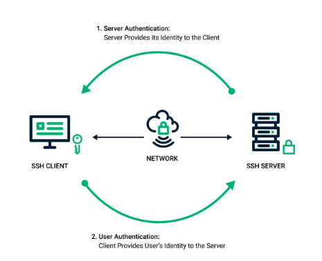

## SSH

# Configuració inicial

Obre la teva aplicació de terminal
Instal·la el paquet openssh-server a Ubuntu amb:
```sh
sudo apt install openssh-server
```

Activa el servidor SSH a Ubuntu amb:

```sh
sudo systemctl enable ssh
```

Firewall

Per defecte, el tallafoc bloquejarà l'accés SSH. Per tant, has d'habilitar ufw i obrir el port SSH.

Comprova si el firwall està activat:
```sh
sudo ufw status
```

Si no està activat actival
```sh
sudo ufw enable
```

Obre el port tcp 22 per SSH utilitzant el tallafoc ufw, executa:
```sh
sudo ufw allow ssh
```
Felicitats! Ara tens el servidor SSH instal·lat i en funcionament al teu servidor Ubuntu. Pots connectar-t'hi utilitzant un client SSH

Per habilitar o denegar  

```sh
sudo ufw allow/deny port/tcp
```

Per eliminar norma
```sh
sudo ufw delete allow/deny port/tcp
```

Config ssh server

Editar el fitxer de configuració realitzant una còpia de seguretat prèvia.
```sh
sudo cp /etc/ssh/sshd_config /etc/ssh/sshd_config.original
sudo nano /etc/ssh/sshd_config
```

De moment anem a veure com configurar ssh utilitzant només les claus dels usuaris del sisttema. 

Per això hem de modificar el /etc/ssh/sshd_conf

**# Permite autenticación por clave pública**
PubkeyAuthentication no
 
**# Permite autenticación por contraseña**
PasswordAuthentication yes


Per conectar-nos a traves del client ho fem via: 
```sh
ssh isard@192.168.1.100
```

Canvi de port
Per defecte ssh utilitza el port 22, és habitual, sobretot quan fem servir servidors amb IP pública, canviar de port, ja que molts atacs automatitzats, ho fan directament a través del port 22. Per tant anem a veure com podem modificar el port. 
**# Puerto**
Port 22


Es pot fer servir qualsevol port 1024 and 65536 sempre i quan no estigui fet servir. 

Amb l’eina netstat podem saber quins ports s’estan fent servir
Aquí tens un breu resum d'alguns usos comuns de la comanda netstat:
**netstat:** Executar la comanda sense opcions mostrarà una llista de sockets oberts.
**netstat -a:** Mostra totes les connexions i ports en escolta.
**netstat -t:** Mostra només connexions TCP.
**netstat -u:** S'utilitza per mostrar només connexions UDP.
**netstat -n:** Mostra adreces numèriques en lloc de determinar noms simbòlics d'amfitrió, port o usuari.
**netstat -s:** Mostra estadístiques per protocol. Per defecte, es mostren estadístiques de TCP, UDP i IP. L'opció -p es pot utilitzar per especificar un subconjunt.
**netstat -r:** Aquesta comanda s'utilitza per mostrar la taula d'encaminament.
**netstat -i:** Pots mostrar les interfícies que s'estan utilitzant per a les connexions de xarxa amb aquesta comanda.

Per accedir desde el client amb un port diferent ho hem de fer amb 
```sh
ssh isard@192.168.1.100 -p "newport"
```

Quan tenim moltes màquines remotes és un “merder” enrecordar-se de totes les ip’s. Per això normalment es fa servir un DNS que ho veurem més endevant però, de moment, podem afegir la màquina del server com un nom conegut al nostre client. 

Per fer-ho modificarem el /etc/hosts 
```sh
192.168.1.100   m08server
```


I per conectar-nos farem 
```sh
ssh isard@m08server -p "newport"
```


Fins aquí hem vist com accedir a un servidor remot, però tecnicament no estem utilitzat la potencia de la seguretat de ssh, això és perquè ens falta configurar les claus. 
SSH key

Com funciona l’ssh per claus? 




La parella de claus SSH s'utilitza per autenticar la identitat d'un usuari o procés que vol accedir a un sistema remot mitjançant el protocol SSH. La clau pública és utilitzada tant per l'usuari com pel servidor remot per xifrar missatges. Al servidor remot, es guarda en un fitxer de clau pública. Del costat de l'usuari, es guarda en un programari de gestió de claus SSH o en un fitxer al seu ordinador. La clau privada es manté només en el sistema que s'utilitza per accedir al servidor remot i s'utilitza per desxifrar missatges.

Quan un usuari o procés sol·licita una connexió al servidor remot utilitzant el client SSH, s'inicia una seqüència de repte-resposta per completar l'autenticació. El servidor SSH reconeix que s'està sol·licitant una connexió i envia un missatge de repte xifrat utilitzant la informació de la clau pública compartida. El client SSH desxifra el missatge de repte i respon al servidor. L'usuari o procés ha de respondre correctament al repte per obtenir accés. Aquesta seqüència de repte-resposta es produeix automàticament entre el client i el servidor SSH sense necessitat d'acció manual per part de l'usuari.

Generar el parell de claus, pública i privada (al directori ~/.ssh/).

Les claus privades solen tenir permisos 600 i root com a propietari.

Les claus públiques solen tenir permisos 644 i root com a propietari.
```sh
ssh-keygen -t rsa -b 2048 -f ~/.ssh/ssh_host1_key
```

	rsa és l'algoritme d'encriptació utilitzat.
	2048 és la longitud en bits de la clau.

Instal·lar la clau pública a la màquina remota.

```sh
ssh-copy-id -i ~/.ssh/ssh_host1_key.pub user_remote@host_remote
```

Comprovar que s'ha afegit la màquina remota en el fitxer de màquines conegudes.

```sh
cat ~/.ssh/known_hosts
```

Accedir a la màquina remota sense usuari i contrasenya.
```sh
ssh host_remote
```

Comprovar que s'ha instal·lat correctament la clau pública a la màquina remota.
```sh
cat ~/.ssh/authorized_keys
```
